# 📊 Resume Buddy — Complete Diagrams

> All diagrams for the Resume Buddy AI SaaS Application, rendered using Mermaid.

---

## Table of Contents

| # | Category | Diagram |
|---|----------|---------|
| 1 | 🏗️ System & Architecture | [System Architecture](#1-system-architecture-diagram) |
| 2 | 🏗️ System & Architecture | [Cloud Deployment](#2-cloud-deployment-diagram) |
| 3 | 🏗️ System & Architecture | [Microservices / API Architecture](#3-microservices--api-architecture-diagram) |
| 4 | 🔁 Process & Flow | [User Workflow](#4-user-workflow-diagram) |
| 5 | 🔁 Process & Flow | [Resume Analysis Flow](#5-resume-analysis-flow-diagram) |
| 6 | 🔁 Process & Flow | [Data Flow Diagram (DFD – Level 1)](#6-data-flow-diagram-dfd--level-1) |
| 7 | 🧩 Software Engineering | [Use Case Diagram](#7-use-case-diagram) |
| 8 | 🧩 Software Engineering | [Entity Relationship (ER) Diagram](#8-entity-relationship-er-diagram) |
| 9 | 🧩 Software Engineering | [Sequence Diagram — Resume Analysis](#9-sequence-diagram--resume-analysis) |
| 10 | 🧠 AI / ML | [AI Resume Analysis Pipeline](#10-ai-resume-analysis-pipeline-diagram) |
| 11 | 🧠 AI / ML | [ATS Scoring & Keyword Matching](#11-ats-scoring--keyword-matching-diagram) |
| 12 | 🧠 AI / ML | [Interview Question Generation Flow](#12-interview-question-generation-flow) |
| 13 | 🎨 Product & UX | [User Flow (Landing → Dashboard → Features)](#13-user-flow-diagram) |
| 14 | 🎨 Product & UX | [Dashboard Navigation](#14-dashboard-navigation-diagram) |
| 15 | 🎨 Product & UX | [Resume Builder Screen Flow](#15-resume-builder-screen-flow) |
| 16 | 💼 Business / SaaS | [Subscription & Billing Flow](#16-subscription--billing-flow-diagram) |
| 17 | 💼 Business / SaaS | [Admin Panel Architecture](#17-admin-panel-architecture-diagram) |

---

## 🏗️ System & Architecture

### 1. System Architecture Diagram

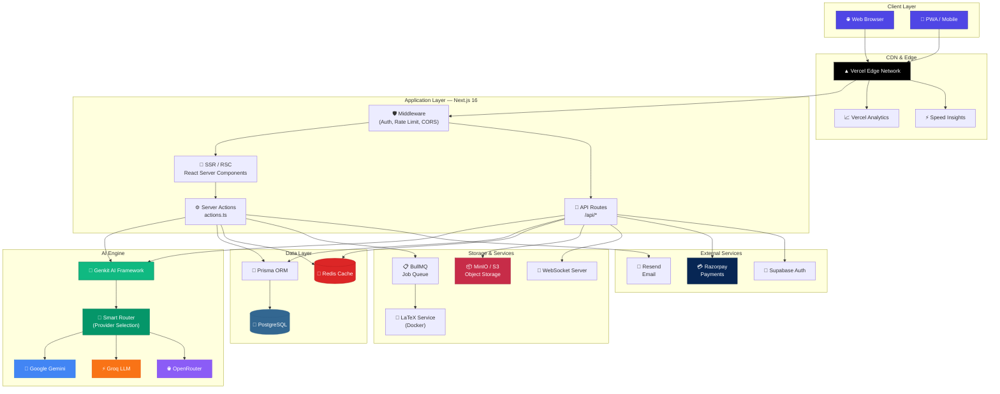

---

### 2. Cloud Deployment Diagram

```mermaid
graph TB
    subgraph "Vercel Cloud"
        direction TB
        Edge["Edge Functions<br/>(Middleware)"]
        Serverless["Serverless Functions<br/>(API Routes)"]
        Static["Static Assets<br/>(Next.js Build)"]
        CDN["Vercel CDN<br/>(Global Cache)"]
    end

    subgraph "Container / Docker Infrastructure"
        direction TB
        DockerCompose["🐳 Docker Compose"]
        PGContainer["PostgreSQL Container<br/>Port: 5432"]
        RedisContainer["Redis Container<br/>Port: 6379"]
        MinIOContainer["MinIO Container<br/>Port: 9000 / 9001"]
        LaTeXContainer["LaTeX Service Container<br/>Port: 3001"]
    end

    subgraph "Managed Services"
        SupabaseCloud["Supabase<br/>(Auth + Fallback DB)"]
        RazorpayAPI["Razorpay API<br/>(Payments)"]
        ResendAPI["Resend API<br/>(Transactional Email)"]
        GoogleAI["Google AI Platform<br/>(Gemini API)"]
        GroqCloud["Groq Cloud<br/>(LLM Inference)"]
    end

    subgraph "CI / CD Pipeline"
        GitHub["GitHub Repository"]
        Actions["GitHub Actions"]
        Preview["Preview Deployments"]
        Production["Production Deploy"]
    end

    subgraph "Monitoring"
        VercelAnalytics["Vercel Analytics"]
        Lighthouse["Lighthouse CI"]
        HealthCheck["/api/health Endpoint"]
    end

    GitHub --> Actions
    Actions --> Preview
    Actions --> Production
    Production --> Edge
    Production --> Serverless
    Production --> Static
    Static --> CDN

    Serverless --> PGContainer
    Serverless --> RedisContainer
    Serverless --> MinIOContainer
    Serverless --> LaTeXContainer
    Serverless --> SupabaseCloud
    Serverless --> RazorpayAPI
    Serverless --> ResendAPI
    Serverless --> GoogleAI
    Serverless --> GroqCloud
    DockerCompose --> PGContainer
    DockerCompose --> RedisContainer
    DockerCompose --> MinIOContainer
    DockerCompose --> LaTeXContainer

    Serverless --> HealthCheck
    VercelAnalytics --> Serverless
    Lighthouse --> Static

    style Edge fill:#000,stroke:#333,color:#fff
    style Serverless fill:#000,stroke:#333,color:#fff
    style Static fill:#000,stroke:#333,color:#fff
    style CDN fill:#000,stroke:#333,color:#fff
    style DockerCompose fill:#2496ED,stroke:#1D7AC2,color:#fff
    style PGContainer fill:#336791,stroke:#2D5F8A,color:#fff
    style RedisContainer fill:#DC2626,stroke:#B91C1C,color:#fff
    style MinIOContainer fill:#C72C48,stroke:#A12340,color:#fff
    style LaTeXContainer fill:#008080,stroke:#006666,color:#fff
    style GitHub fill:#181717,stroke:#333,color:#fff
```

---

### 3. Microservices / API Architecture Diagram

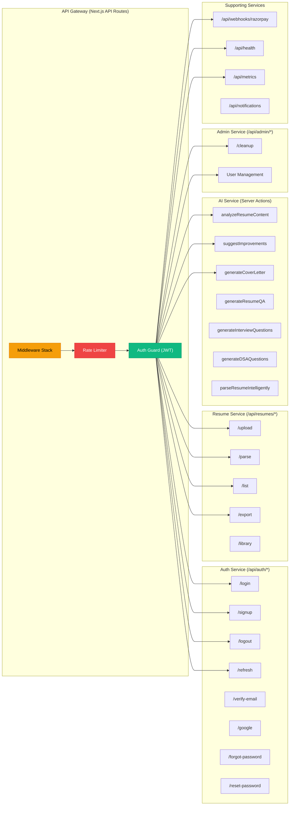

---

## 🔁 Process & Flow

### 4. User Workflow Diagram

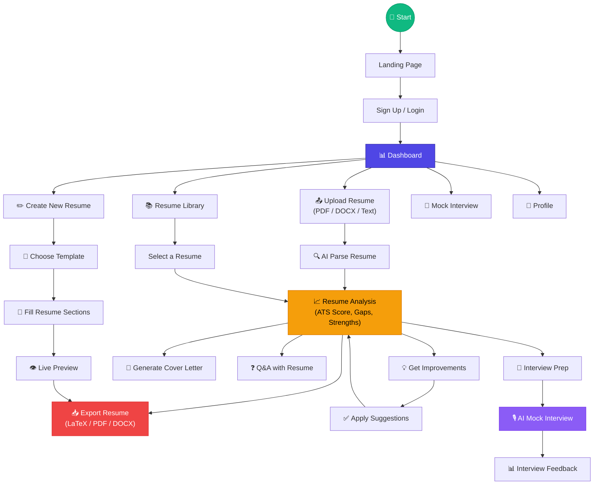

---

### 5. Resume Analysis Flow Diagram

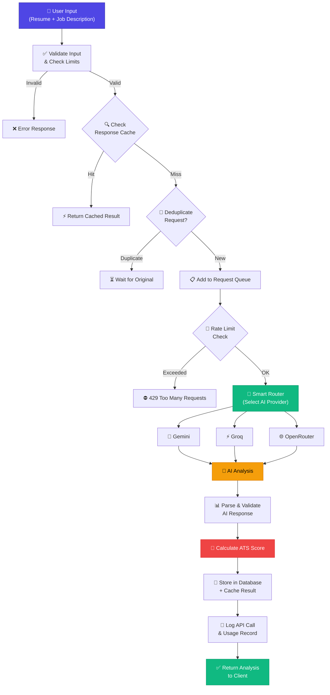

---

### 6. Data Flow Diagram (DFD – Level 1)

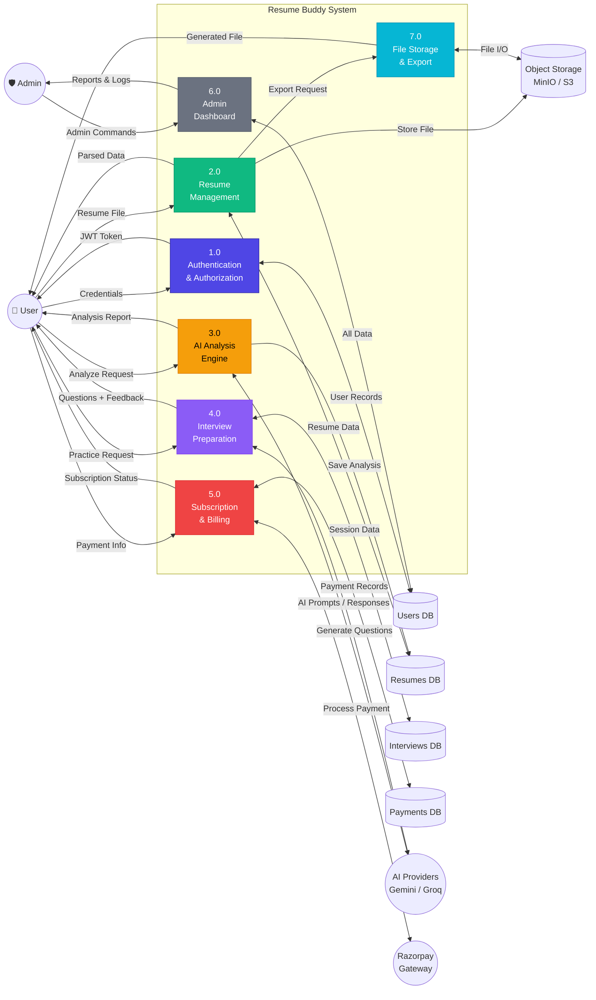

---

## 🧩 Software Engineering

### 7. Use Case Diagram

```mermaid
graph TB
    subgraph Actors
        User(("👤 User"))
        Admin(("🛡️ Admin"))
        AI(("🤖 AI Engine"))
        Payment(("💳 Payment GW"))
    end

    subgraph "Authentication"
        UC1["Sign Up (Email/Google)"]
        UC2["Log In / Log Out"]
        UC3["Reset Password"]
        UC4["Verify Email"]
    end

    subgraph "Resume Management"
        UC5["Upload Resume (PDF/DOCX)"]
        UC6["Create Resume from Scratch"]
        UC7["View Resume Library"]
        UC8["Export Resume (PDF/DOCX/LaTeX)"]
        UC9["Delete Resume"]
    end

    subgraph "AI Analysis"
        UC10["Analyze Resume"]
        UC11["Get ATS Score"]
        UC12["Get Improvement Suggestions"]
        UC13["Generate Cover Letter"]
        UC14["Q&A with Resume"]
    end

    subgraph "Interview Prep"
        UC15["Generate Interview Questions"]
        UC16["Practice Mock Interview"]
        UC17["Get Answer Feedback"]
        UC18["Generate DSA Questions"]
    end

    subgraph "Billing"
        UC19["View Pricing Plans"]
        UC20["Subscribe to Pro Plan"]
        UC21["Manage Subscription"]
    end

    subgraph "Administration"
        UC22["View User Analytics"]
        UC23["Manage Users"]
        UC24["View API Logs"]
        UC25["Configure Subscription Pricing"]
        UC26["Database Cleanup"]
    end

    User --> UC1 & UC2 & UC3 & UC4
    User --> UC5 & UC6 & UC7 & UC8 & UC9
    User --> UC10 & UC11 & UC12 & UC13 & UC14
    User --> UC15 & UC16 & UC17 & UC18
    User --> UC19 & UC20 & UC21

    Admin --> UC22 & UC23 & UC24 & UC25 & UC26

    UC10 -.->|"<<uses>>"| AI
    UC11 -.->|"<<uses>>"| AI
    UC12 -.->|"<<uses>>"| AI
    UC13 -.->|"<<uses>>"| AI
    UC14 -.->|"<<uses>>"| AI
    UC15 -.->|"<<uses>>"| AI
    UC16 -.->|"<<uses>>"| AI
    UC17 -.->|"<<uses>>"| AI
    UC18 -.->|"<<uses>>"| AI

    UC20 -.->|"<<uses>>"| Payment
    UC21 -.->|"<<uses>>"| Payment

    style User fill:#4F46E5,stroke:#3730A3,color:#fff
    style Admin fill:#EF4444,stroke:#DC2626,color:#fff
    style AI fill:#10B981,stroke:#059669,color:#fff
    style Payment fill:#F59E0B,stroke:#D97706,color:#000
```

---

### 8. Entity Relationship (ER) Diagram

```mermaid
erDiagram
    User {
        string id PK "cuid - Firebase UID"
        string email UK "unique"
        string name
        string passwordHash
        string phone UK
        string avatar
        enum role "USER | ADMIN"
        enum status "ACTIVE | SUSPENDED | DELETED"
        boolean emailVerified
        datetime lastLoginAt
        datetime createdAt
        datetime updatedAt
    }

    Account {
        uuid id PK
        string userId FK
        string provider "credentials | google | github"
        string providerAccountId
        string accessToken
        string refreshToken
        datetime expiresAt
    }

    Session {
        uuid id PK
        string sessionId UK
        string userId FK
        string userAgent
        string ipAddress
        datetime expiresAt
        datetime lastActivityAt
    }

    RefreshToken {
        uuid id PK
        string token UK
        string userId FK
        datetime expiresAt
        boolean revoked
        string replacedByToken
    }

    VerificationToken {
        string identifier
        string token
        enum type "EMAIL | PHONE | PASSWORD_RESET"
        datetime expires
    }

    Subscription {
        uuid id PK
        string userId FK_UK "unique"
        enum tier "FREE | PRO"
        enum status "ACTIVE | EXPIRED | CANCELLED | PAST_DUE"
        string razorpaySubscriptionId
        string razorpayCustomerId
        datetime currentPeriodStart
        datetime currentPeriodEnd
    }

    SubscriptionConfig {
        int id PK "singleton row"
        int priceINR
        int pricePaise
        int testPriceINR
        boolean isTestMode
        int durationDays
        string currency
    }

    Payment {
        uuid id PK
        string userId FK
        decimal amount
        string currency
        enum status "PENDING | COMPLETED | FAILED | REFUNDED"
        string razorpayPaymentId UK
        string razorpayOrderId
        string planType
        json metadata
    }

    UsageRecord {
        uuid id PK
        string userId FK
        string feature
        int count
        date date
    }

    ResumeData {
        uuid id PK
        string userId FK
        string title
        text resumeText
        text jobDescription
        string jobRole
        json parsedData
        json analysis
        json improvements
        json qaHistory
        text coverLetter
        boolean isActive
    }

    Interview {
        uuid id PK
        string userId FK
        uuid resumeDataId FK
        enum type "TECHNICAL | BEHAVIORAL | SYSTEM_DESIGN | HR | DSA"
        enum difficulty "EASY | MEDIUM | HARD"
        string role
        json questions
        json answers
        json feedback
        int score
        enum status "NOT_STARTED | IN_PROGRESS | COMPLETED"
    }

    StoredFile {
        uuid id PK
        string userId FK
        uuid resumeDataId FK
        string filename
        string originalName
        string mimeType
        int size
        string bucket
        string objectKey
    }

    GeneratedResume {
        uuid id PK
        string userId FK
        uuid resumeDataId FK
        string templateId
        enum format "LATEX | PDF | DOCX"
        text latexSource
        uuid fileId FK
        enum status "DRAFT | GENERATING | COMPLETED | FAILED"
    }

    AdminAction {
        uuid id PK
        string adminId
        string action
        string targetId
        json details
    }

    ApiCallLog {
        uuid id PK
        string userId
        string provider
        string operation
        int tokensUsed
        int latencyMs
        boolean success
    }

    UserActivity {
        uuid id PK
        string userId
        string action
        json details
        string ipAddress
    }

    User ||--o{ Account : "has"
    User ||--o{ Session : "has"
    User ||--o{ RefreshToken : "has"
    User ||--o| Subscription : "has"
    User ||--o{ Payment : "makes"
    User ||--o{ UsageRecord : "tracks"
    User ||--o{ ResumeData : "owns"
    User ||--o{ Interview : "takes"
    User ||--o{ StoredFile : "uploads"
    User ||--o{ GeneratedResume : "generates"
    ResumeData ||--o{ Interview : "linked to"
    ResumeData ||--o{ StoredFile : "has files"
    ResumeData ||--o{ GeneratedResume : "produces"
    StoredFile ||--o{ GeneratedResume : "stores output"
```

---

### 9. Sequence Diagram — Resume Analysis

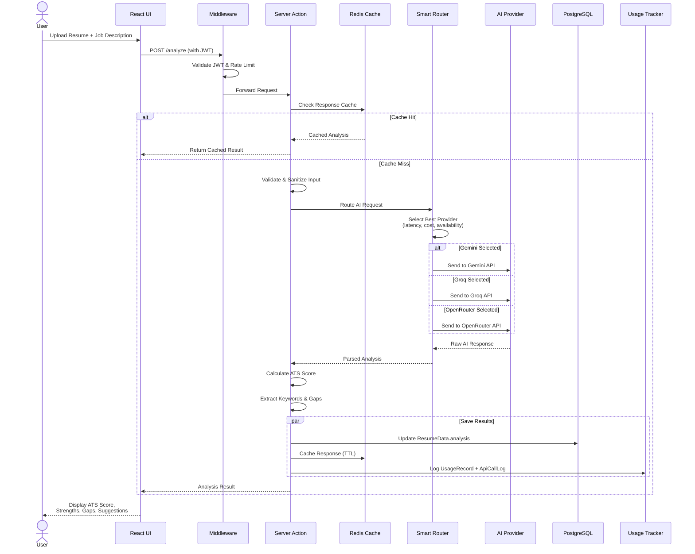

---

## 🧠 AI / ML

### 10. AI Resume Analysis Pipeline Diagram

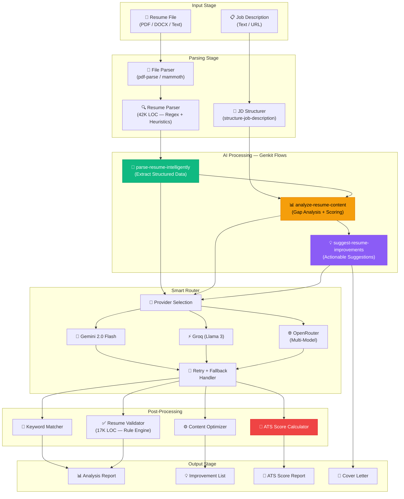

---

### 11. ATS Scoring & Keyword Matching Diagram

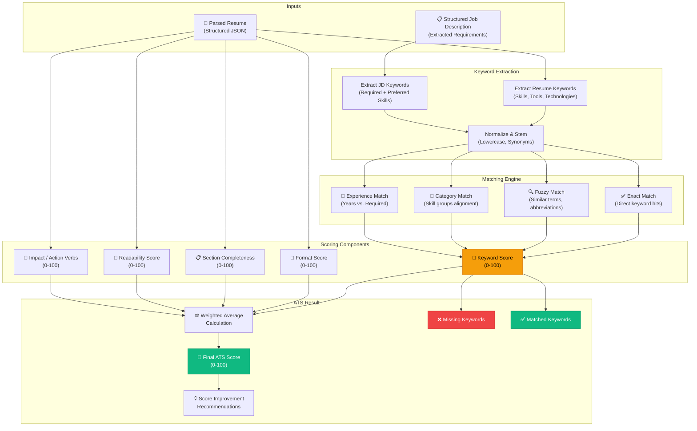

---

### 12. Interview Question Generation Flow

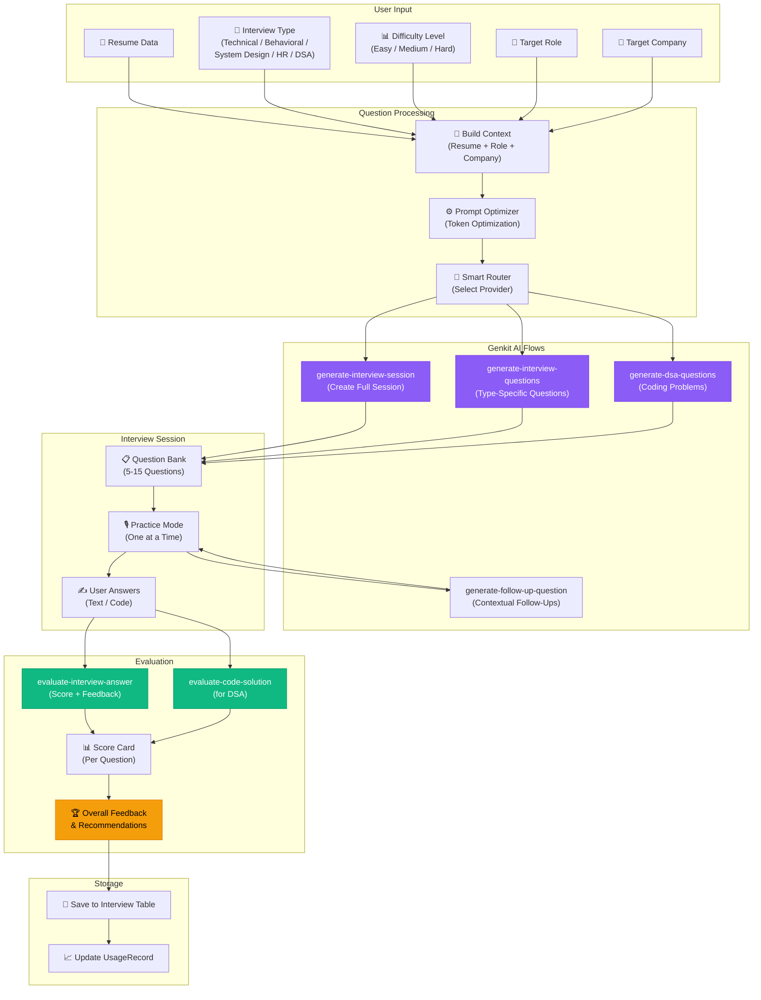

---

## 🎨 Product & UX

### 13. User Flow Diagram

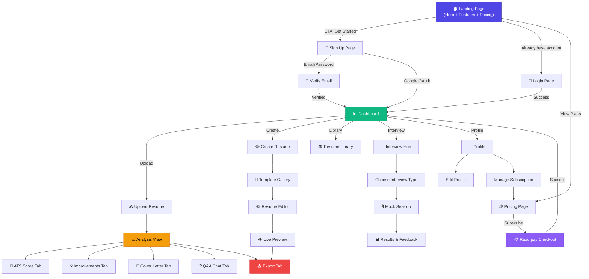

---

### 14. Dashboard Navigation Diagram

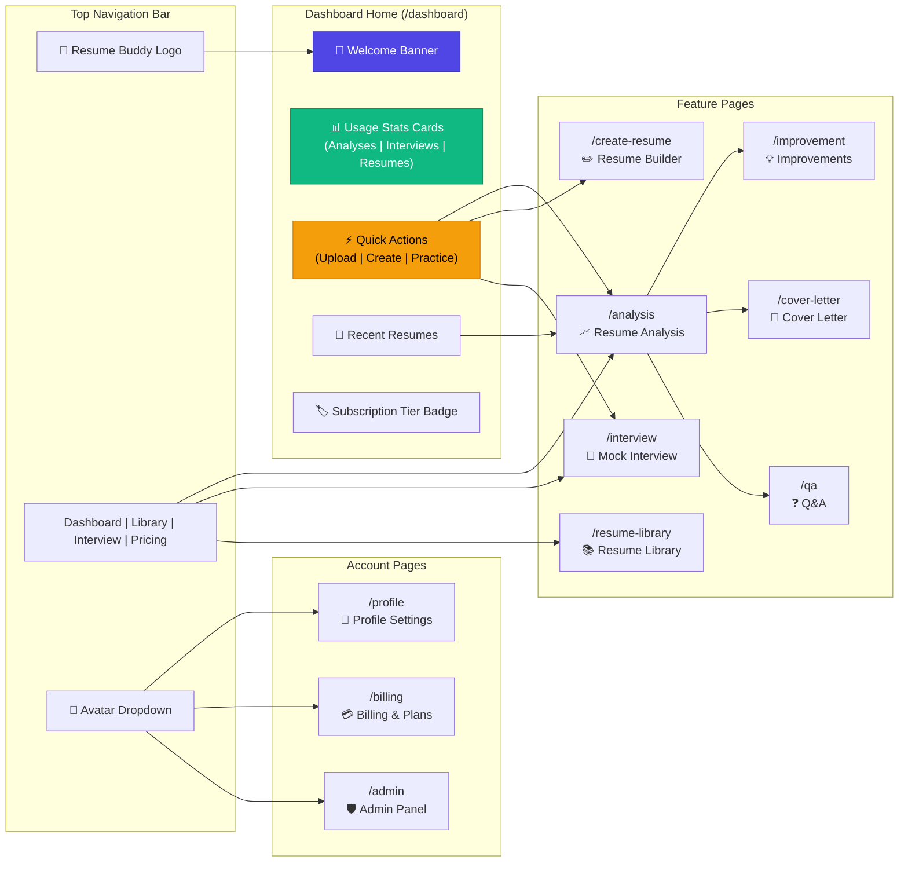

---

### 15. Resume Builder Screen Flow

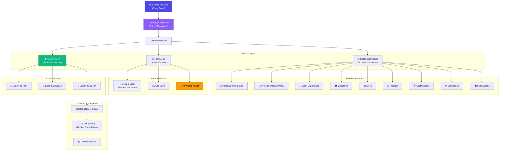

---

## 💼 Business / SaaS

### 16. Subscription & Billing Flow Diagram

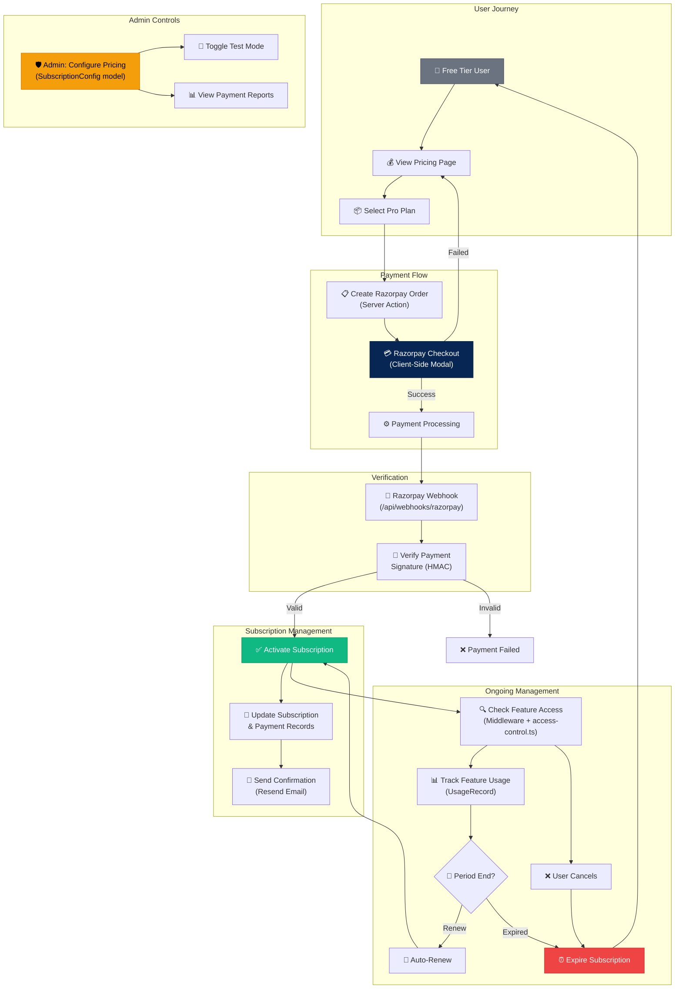

---

### 17. Admin Panel Architecture Diagram

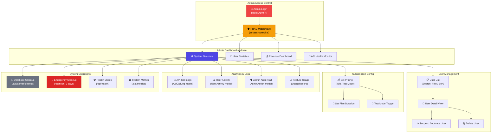

---

## 🏆 Minimum Set Summary

If you need only the **6 most essential diagrams**, refer to:

| # | Diagram | Section |
|---|---------|---------|
| 1 | **System Architecture** | [§1](#1-system-architecture-diagram) |
| 2 | **User Workflow** | [§4](#4-user-workflow-diagram) |
| 3 | **Data Flow Diagram** | [§6](#6-data-flow-diagram-dfd--level-1) |
| 4 | **Use Case Diagram** | [§7](#7-use-case-diagram) |
| 5 | **ER Diagram** | [§8](#8-entity-relationship-er-diagram) |
| 6 | **AI Pipeline** | [§10](#10-ai-resume-analysis-pipeline-diagram) |

---

> **Generated**: February 2026 · Based on Resume Buddy v3 source code analysis
